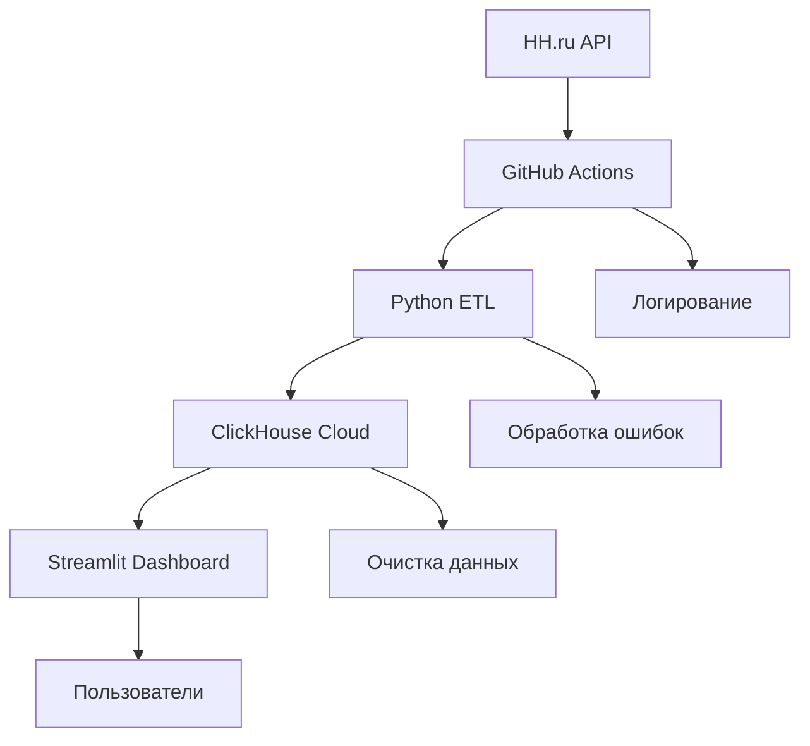

# Архитектура системы

## Обзор архитектуры

HH Analytics построена по принципу **ETL-пайплайна** с ежедневным обновлением данных. Архитектура оптимизирована для надежности и масштабируемости.


### Компоненты системы

1. Data Collection Layer

   - Источник: HH.ru REST API
   - Протокол: HTTPS с аутентификацией
   - Лимиты: 2,000 запросов/день, задержка 0.3с
   - Формат данных: JSON с nested структурами

2. ETL Processing Layer

```python
# Основной ETL-пайплайн
def etl_pipeline():
    extract()   # Парсинг HH API
    transform() # Очистка 
    load()      # Загрузка в ClickHouse
```

Ключевые особенности:

- Дедупликация на уровне приложения
- Обработка различных форматов зарплат
- Валидация и очистка данных
- Логирование каждого этапа

3. Data Storage Layer

```sql
-- Оптимизированная схема ClickHouse
CREATE TABLE vacancies (
    id String,
    salary_from Nullable(Int32),
    -- ... 15 полей
) ENGINE = ReplacingMergeTree(published_at)
PARTITION BY toYYYYMM(created_date)
ORDER BY (id, created_date)
```

### Преимущества ClickHouse:

- Высокая производительность аналитических запросов
- Эффективное сжатие колоночных данных
- Встроенная дедупликация через ReplacingMergeTree
- Полностью managed облачное решение

### Visualization Layer:

Streamlit дашборд включает:
- Real-time подключение к ClickHouse
- Интерактивные фильтры (город, опыт, период)
- Недельные агрегаты для стабильных трендов
- Автоматическое обновление при открытии
